# Using Rhino with Open WebUI

This plugin lets you talk to Rhino in plain language from an Open WebUI chat — "describe the
active document", "make a box 10 by 10 by 10", "list the layers". You type in the chat, and
Rhino does it. It adds tools to your existing model, so if it is able of advanced reasoning and
web search, it can do things like "Take this reference, search the internet for additional
material and and model it"

It is an independent, experimental tool developed in-house at HENN. 
It is not made by McNeel and not by Open WebUI.

---

## Contents

- [Read this part first](#read-this-first)
- [What you need before you start](#requirements)
- [Setting it up — once](#setup)
  - [Step 1 — Open the settings](#step-1-settings)
  - [Step 2 — Tell it where RhinoAI is](#step-2-router)
  - [Step 3 — Connect](#step-3-connect)
  - [Step 4 — Fill in your Open WebUI details](#step-4-open-webui-details)
  - [Step 5 — Tell Open WebUI about it](#step-5-integration)
  - [Step 6 — Reload your browser](#step-6-reload)
  - [Step 7 — Try it](#step-7-try-it)
- [Using it day to day](#day-to-day)
- [When something goes wrong](#troubleshooting)
  - [The dot next to the router box is red](#red-dot)
  - [Nothing happens when I click Start link](#start-link-error)
  - [Connected, but the chat can't see any Rhino tools](#no-tools)
  - [It worked yesterday and today it doesn't](#stopped-working)
  - [I need to report a problem](#report-a-problem)
- [Things worth knowing](#worth-knowing)
- [Words you'll see](#glossary)

---

## Read this part first {#read-this-first}

When you connect, **the chat model can run any command in Rhino, including code, and can read
and write files on your computer** — anything you could do yourself. There is no "are you sure?"
step before each action, and no safe mode.

In practice, that means:

- **Save your work before you connect.** Try it on a copy of a model first, not on something you
  care about.
- **Only connect to an Open WebUI you trust.** Whoever controls it, and whichever model you
  chat with, effectively has their hands in your Rhino.
- **Watch what it does.** If you ask it to tidy up a model, it may delete more than you meant.
- **Don't run Rhino as administrator** while using this.

If any of that is not acceptable for the machine you are on, stop here.

---

## What you need before you start {#requirements}

1. **Windows, and Rhino 8.** It will not work on a Mac.
2. **RhinoAI already working in Rhino.** Type `MCPStart` into the Rhino command line and press
   Enter. If Rhino says it doesn't know that command, you need to install McNeel's Rhino-MCP-Platform
   first — that is a separate thing from this plugin, and nothing here works without it.
3. **An Open WebUI you can log into**, in a browser on this same computer.
4. **Open WebUI permissions to create API key and add user-specific integrations**, as that is what
   the tool uses to connect to Open WebUI. You can set the connection manually without an API key,
   but you need to add user-specific integrations to connect to an MCP server running on your computer.
5. **The plugin, installed from its `.yak` package.** Once it is installed, a small toolbar with
   four buttons appears in Rhino: **Link**, **Settings**, **Monitor**, **Help**. If you don't see it,
   type `OpenWebUIRelayToolbar` into the Rhino command line and press Enter.

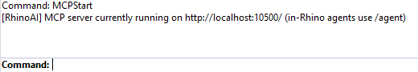
<!-- capture: the Rhino command line right after typing MCPStart, showing it worked -->

---

## Setting it up — once {#setup}

You only do this once. After that, connecting is one click.

### Step 1 — Open the settings {#step-1-settings}

Click **Settings** on the toolbar.

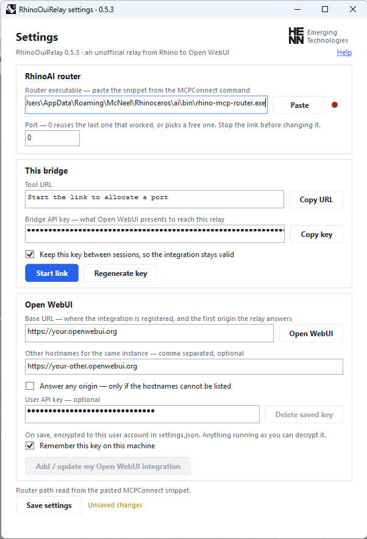
<!-- capture: the whole settings window, nothing filled in yet -->

### Step 2 — Tell it where RhinoAI is {#step-2-router}

Look at the top box, **RhinoAI router**.

There is a round dot at the right-hand end of the box. **Green means it already found it** — most
people will see green, and can skip to Step 3.

If the dot is red:

1. Go to the Rhino command line, type `MCPConnect` and press Enter.
2. A window appears with a **copy** button. Click it.
3. Come back to Settings, click into the **Router executable** box and press **Ctrl+V** — or just
   click the **Paste** button next to it.

You can paste the whole block of text it copied. The plugin pulls the one line it needs out of
it; you don't have to find it yourself.

Hover over the dot at any time and it will tell you what it thinks is wrong.

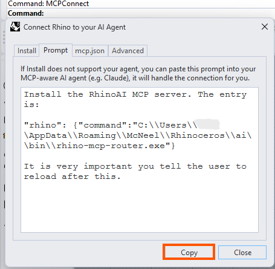
<!-- capture: the MCPConnect window; circle or arrow the copy button -->

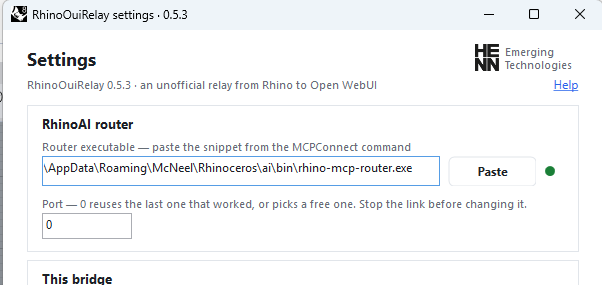
<!-- capture: that row only. Green = the router was found -->

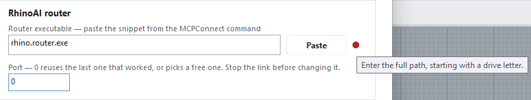
<!-- capture: that row only, hovering the dot so the tooltip shows.
     To force red, rename rhino-mcp-router.exe briefly, or type a nonsense path -->

### Step 3 — Connect {#step-3-connect}

1. Click **Start link**.
2. A warning appears about what the tools can do. Read it, and click **Yes** if you agree.

It takes a few seconds. When it is connected, the window says it is running and how many tools it
found.

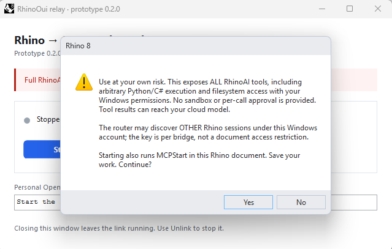
<!-- capture: the whole dialog, with all of its text readable -->

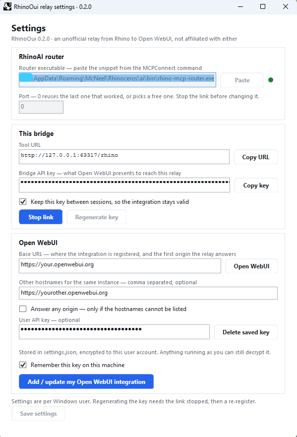
<!-- capture: blur the bridge API key -->

### Step 4 — Fill in your Open WebUI details {#step-4-open-webui-details}

Scroll down to the **Open WebUI** box.

- **Base URL** — the web address you normally use for Open WebUI, for example
  `https://chat.yourcompany.com`. Copy it from your browser's address bar.
- **User API key** — in Open WebUI, click your name at the bottom left → **Settings** →
  **Account** → under **API keys**, create one and copy it. Paste it here.

If you tick **Remember this key on this machine**, you won't have to paste it again next time.

Finally, hit **Save Settings**

<!-- capture: Open WebUI > Settings > Account > API keys. Blur any real key -->

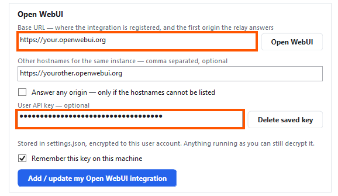
<!-- capture: blur the key field -->

### Step 5 — Tell Open WebUI about it {#step-5-integration}

Still in Settings, click **Add / update my Open WebUI integration**, and confirm.

This hands Open WebUI the address and password it needs to reach Rhino.

### Step 6 — Reload your browser {#step-6-reload}

**This step is easy to miss and nothing works without it.** Go to your Open WebUI tab, reload the
page (F5), and start a **new** chat. If the browser asks for permission to reach devices on your
local network, allow it.

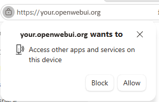
<!-- capture: the browser's own permission prompt, not an Open WebUI dialog -->

### Step 7 — Try it {#step-7-try-it}

In the new chat, activate the tool

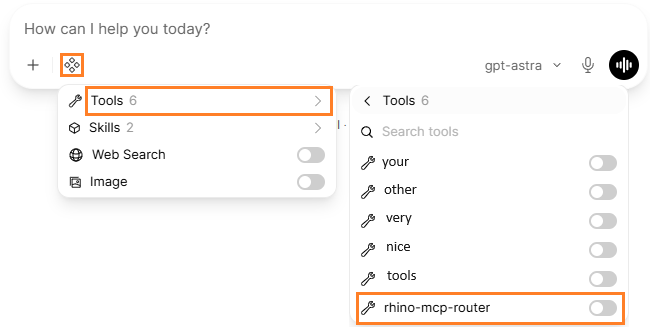
<!-- capture: the tools menu in the chat box, with the Rhino entry switched on -->

and then type:

> List the Rhino sessions and describe the active document. Do not change anything.

If it answers with something about your model, you're done.

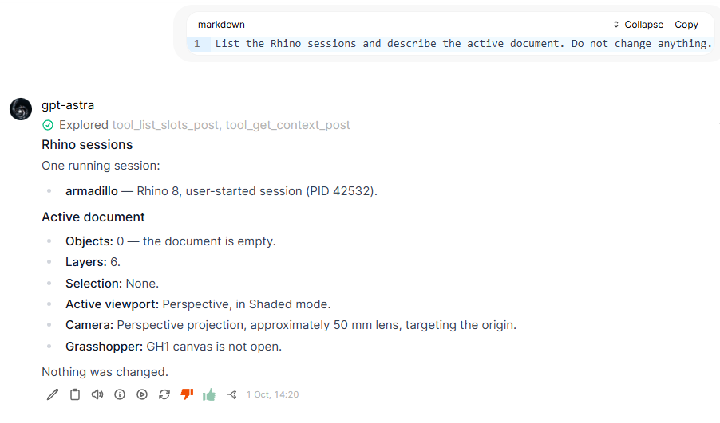
<!-- capture: the question and the answer together, on a model you do not mind showing -->

---

## Using it day to day {#day-to-day}

1. Open Rhino.
2. Click **Link** on the toolbar and accept the warning.
3. Go to Open WebUI, activate the tool, and chat.

That's it. You do not need to repeat the setup, and you do not need to touch the integration
again — the plugin keeps the same address and password between sessions on purpose.

When you are finished, click **Unlink / stop**. Closing Rhino also stops it.

**Closing the plugin window does not disconnect it.** Use **Unlink / stop** for that.

---

## When something goes wrong {#troubleshooting}

### The dot next to the router box is red {#red-dot}

The plugin cannot find RhinoAI. Hover over the dot — it says why. Usually: run `MCPConnect` in
Rhino, copy what it gives you, and paste it into the box.

### Nothing happens when I click Start link, or it reports an error {#start-link-error}

Run `MCPStart` in Rhino by hand and see what it says. If that fails, the problem is with RhinoAI,
not with this plugin.

### Rhino says it's connected, but the chat can't see any Rhino tools {#no-tools}

Nearly always one of these, in order of likelihood:

1. **You didn't reload the browser.** Reload the Open WebUI page and start a new chat.
2. **You're on a different web address than the one in Settings.** If your Open WebUI answers on
   more than one address — say `chat.company.com` and `webui.company.com` — put the others in
   **Other hostnames for the same instance** in Settings and save. You do not need to reconnect.
3. **The browser blocked it.** Allow local network access if it asked, and try a different
   browser if your workplace locks yours down.

### It worked yesterday and today it doesn't {#stopped-working}

Click **Add / update my Open WebUI integration** again, then reload the browser. If you clicked
**Regenerate key** at some point, this is expected — that deliberately changes the password and
Open WebUI needs telling.

### I need to report a problem {#report-a-problem}

Click **Monitor** on the toolbar. It shows the status and a log. Use **Copy manual setup
instructions** or **Open in editor** to get the details, and send those along with what you were
doing.

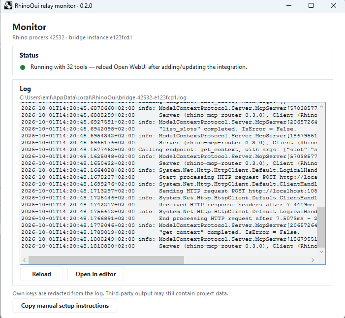
<!-- capture: blur anything key-shaped in the log -->

---

## Things worth knowing {#worth-knowing}

**It can see other open Rhino windows.** If you have several Rhino files open, the model may find
and change the wrong one. Ask it which session it is working on before you let it edit anything.

**Stopping is not undo.** **Unlink / stop** cuts the connection, but anything already done to your
model stays done, and a script that is already running may finish. Use Rhino's own undo.

**It can close other Rhino windows.** If RhinoAI opened extra Rhino instances, stopping the link
closes those too, and they may lose unsaved work.

---

## Words you'll see {#glossary}

| In the plugin | What it means |
|---|---|
| **Link** / **Start link** | Connect Rhino to Open WebUI |
| **Unlink / stop** | Disconnect |
| **Router** | McNeel's RhinoAI program that this plugin talks to |
| **Integration** | The entry inside Open WebUI that points back at your Rhino |
| **Bridge API key** | A password the plugin makes up so only your Open WebUI can reach your Rhino |
| **Tool URL** | The address on your own computer that Open WebUI calls |
